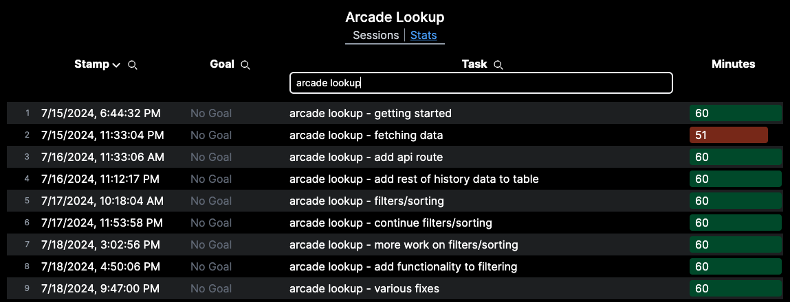
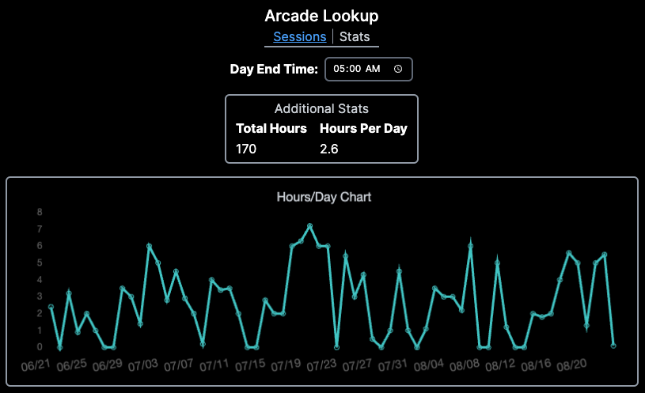

# Arcade Lookup

## Overview

This is a centralized tool for viewing all your Arcade session data. It fetches data using the [Hack Hour (Arcade) API](https://github.com/hackclub/hack-hour).

It consists of two pages:

- **Sessions page**
  - This page shows a list of every Arcade session you've ever started
  - Sessions can be filtered by clicking the magnifying glass icon on the desired table header and typing a search term
  - Sessions can be sorted by clicking any table header
    - The arrow next to the table header indicates whether rows are ascending or descending
  - A red "Minutes" cell indicates the session was less than 60 minutes
  - An orange "Minutes" cell indicates the session is still in progress
  - 
- **Stats page**
  - This page shows a graph of how many hours you've spent hacking per day
  - If you sometimes hack past midnight and want those sessions to be part of the prior day, you can set a custom day end time
  - You can zoom the chart by pinching or using a scroll wheel
    - Alternatively, you can click and drag while pressing ALT
  - Once zoomed, you can pan the graph by clicking and dragging
  - 

## Usage

This is built with Next.js and is primarily intended to be ran locally. Your API key is stored in a `.env.local` file on the server.

### Installation

_These instructions require that you have already installed [Git](https://git-scm.com/downloads) and [Node.js](https://nodejs.org/en/download/package-manager)._

```bash
git clone https://github.com/TechPandaPro/arcade-lookup.git
cd arcade-lookup
npm install
```

### Adding Your API Key

This project requires your API key in order to fetch your session data. You can generate an API key using the `/api` command in Slack.

After your API key has been generated, it can be added to the `.env.local` file with a name of `API_KEY`:

```bash
echo 'API_KEY="mysupercoolapikey"' > .env.local
```

### Starting the Server

You can start the Next.js development server with `npm run dev`. The Arcade Lookup tool should then be accessible at `http://localhost:3000`.
